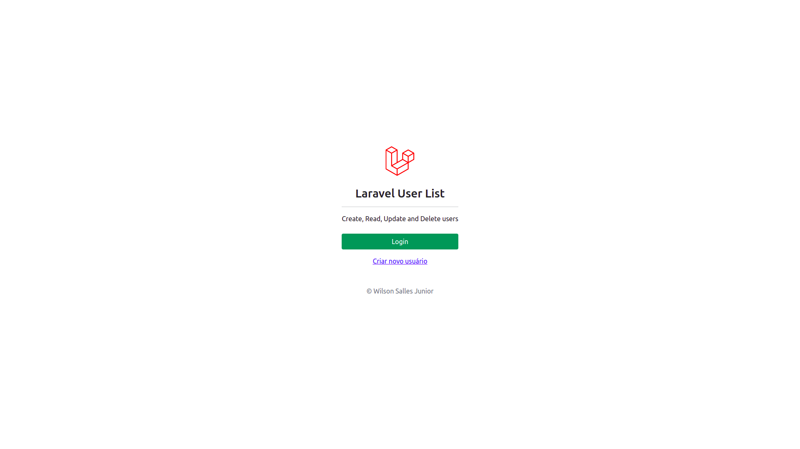
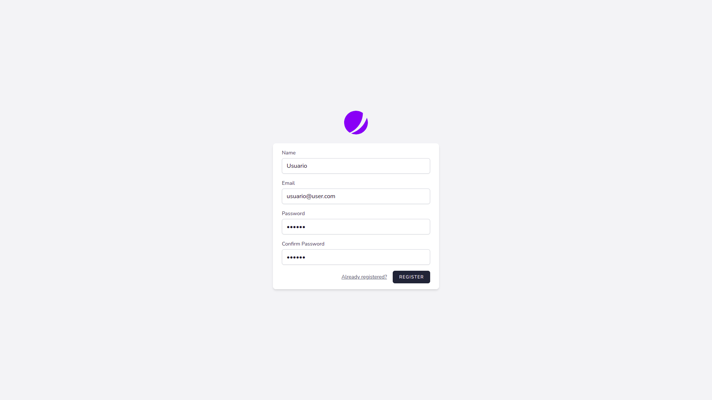
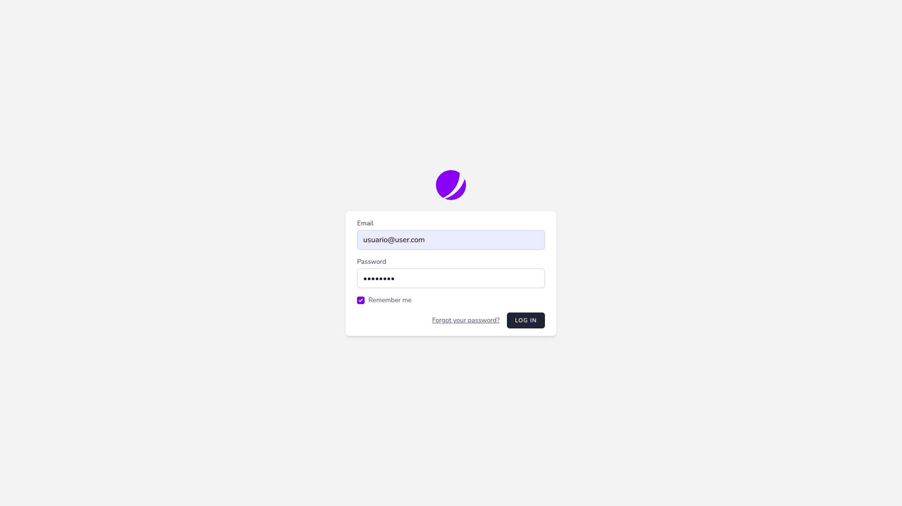
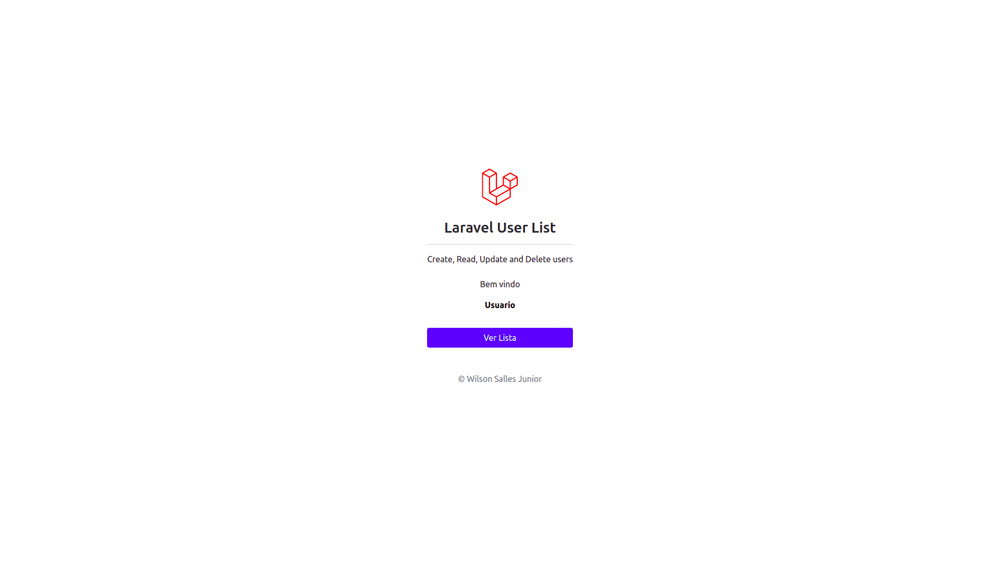
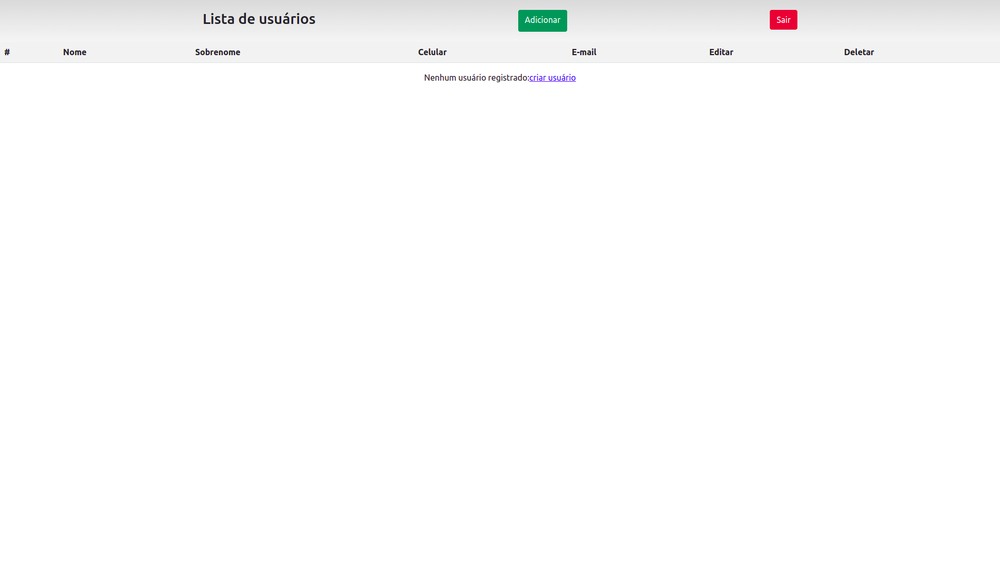
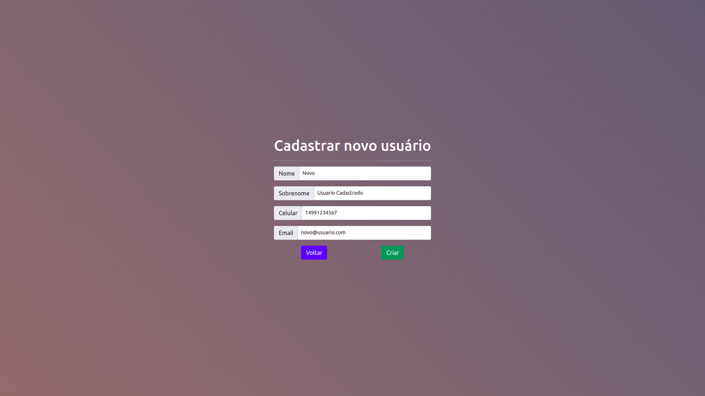
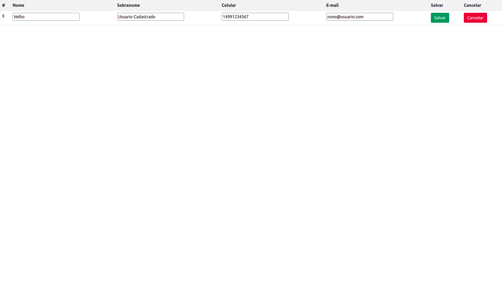
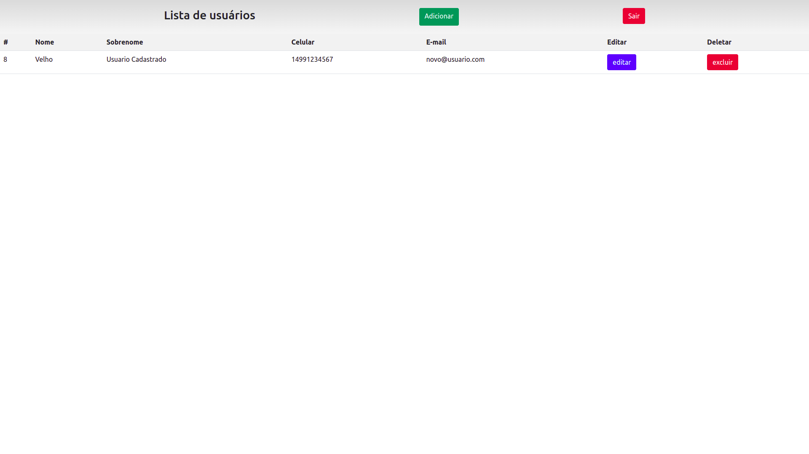
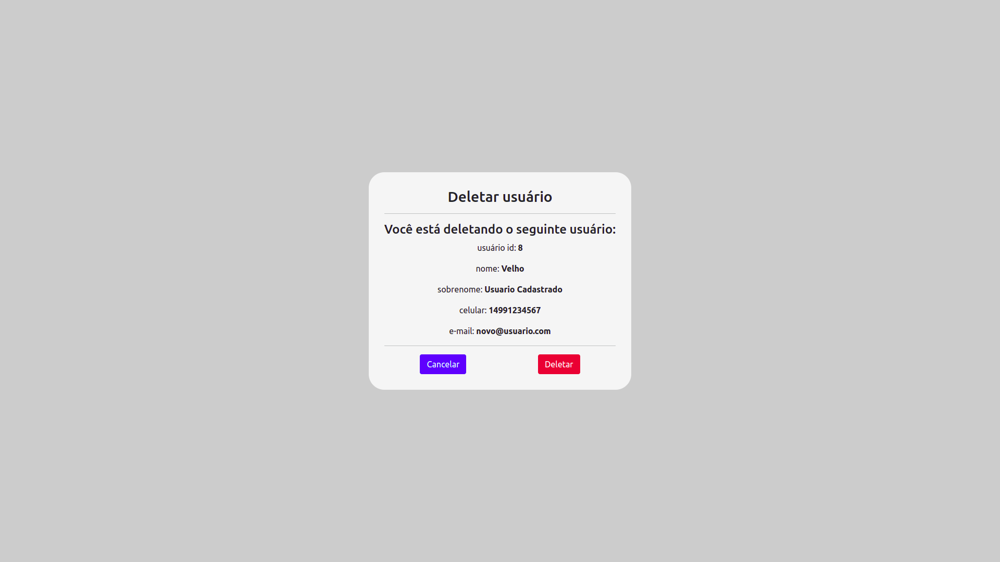
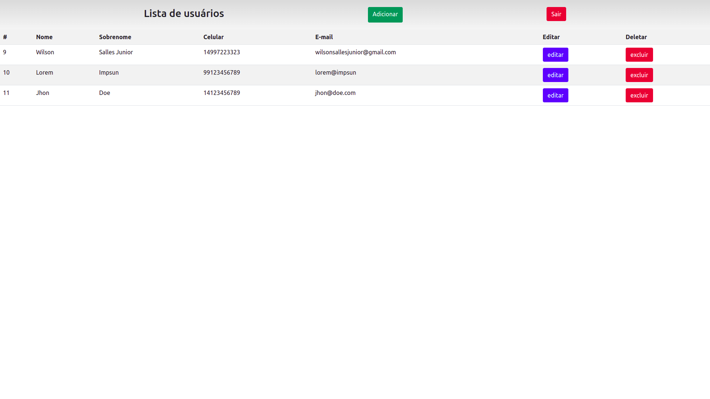

# Laravel CRUD
## Introdução:
Fiz este projeto para praticar PHP, Laravel e CRUD, nele, é possível entrar através de uma tela de login e ter acesso a uma lista, nesta lista, é possível ler o id, nome, sobrenome, celular e email, bem como é possível editar e deletar, já na barra de navegação, é possível sair do login e criar um novo item na lista.
## Objetivos:
- [x] Tela de Login:
- - [x] Verificar usuário;
- - [x] Entrar;
- - [x] Criar usuário.
- [x] Lista de Usuários:
- - [x] Conectar ao banco de dados;
- - [x] Ler usuários;
- - [x] Criar usuário;
- - [x] Editar usuário;
- - [x] Deletar usuário.

# Telas
## Tela inicial

## Tela cadastro

## Tela login

## Tela pós login

## Tela lista vazia

## Tela cadastro de usuário

## Tela editar usuário

## Tela usuario editado

## Tela deletar usuário

## Tela varios usuários
